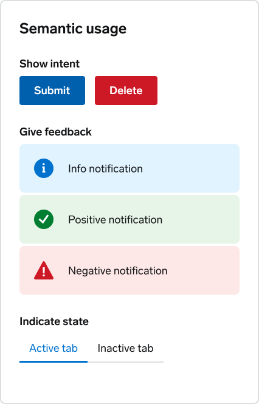
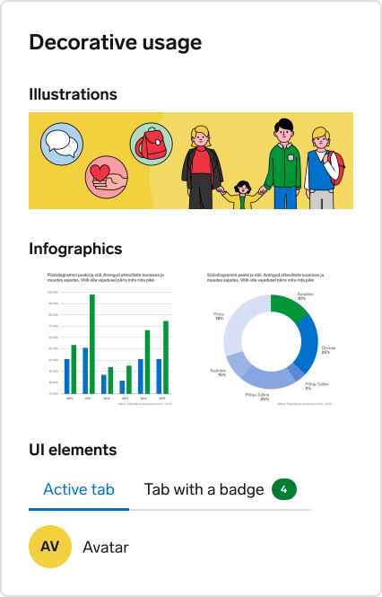

# Overview

TDS color system is based on <a className="tds-link tds-link--inline" href="https://identiteet.tallinn.ee/#/pohielemendid/varvid">Tallinn’s visual identity</a> and has been extended with extra shades.

## Primary colour

The primary colour of Tallinn is blue. Shades of blue are mainly used for buttons, links, selection states and for highlighting information.

  

    

      

        <b>Blue 10</b>
         
        #E0F3FF
      

    

    

      

        <b>Blue 20</b>
         
        #C6E4FB
      

    

    

      

        <b>Blue 30</b>
         
        #99CCF5
      

    

    

      

        <b>Blue 40</b>
         
        #67B0EA
      

    

  

  

    

      

        <b>Blue 50</b>
         
        Primary shade
      

      
#0072CE

    

  

  

    

      

        <b>Blue 60</b>
         
        #0060AD
      

    

    

      

        <b>Blue 70</b>
         
        #05427F
      

    

    

      

        <b>Blue 80</b>
         
        #03294E
      

    

    

      

        <b>Blue 90</b>
         
        #041D3A
      

    

  

### Usage examples

Here are just some of the possible usage scenarios for primary colours:

  

    
10

    
20

    
Backgrounds in light mode

  

  

    
20

    
30

    

      Hover and active states for buttons and links in dark mode
    

  

  

    
40

    

    
Buttons and links in dark mode

  

  

    
50

    

    

      As a primary colour, Blue 50 can be used wherever you need to add
      Tallinn’s identity to an interface (for example, as a background colour
      for website header, banners, etc). Try not to use it on very large
      surfaces (more than 1/3 of the screen) though as it is quite intense.
      Other usage scenarios may include indicating selected state in components,
      informational feedback, etc.
    

  

  

    
60

    

    

      Buttons and links in light mode
    

  

  

    
70

    
80

    

      Hover and active states for buttons and links in light mode
    

  

  

    
80

    
90

    
Backgrounds in dark mode

  

## Secondary colours

Secondary colors - green, red, yellow and their shades - are mainly used for indicating status and for decorative purposes.

 

      {/* Green Palette */}
      

        

          
Green 10

          #E6F5E7
        

        

          
Green 20

          #CDEAD1
        

        

          
Green 30

          #9FDAA8
        

        

          
Green 40

          #6DBB77
        

        

        

          
Green 50

          
Primary shade

          

          

          #017E31
          

        

        

          
Green 60

          #07692C
        

        

          
Green 70

          #055624
        

        

          
Green 80

          #013C18
        

        

          
Green 90

          #012810
        

      

      {/* Red Palette */}
      

        

          
Red 10

          #FEE8E7
        

        

          
Red 20

          #FED9D8
        

        

          
Red 30

          #FCB3B0
        

        

          
Red 40

          #F97A76
        

        

        

          
Red 50

          
Primary shade

          

           

          #CC1925
          

        

        

          
Red 60

          #B10612
        

        

          
Red 70

          #89050E
        

        

          
Red 80

          #63030A
        

        

          
Red 90

          #40070C
        

      

      {/* Yellow Palette */}
      

        

          
Yellow 10

          #FFF7D6
        

        

          
Yellow 20

          #FBEDB1
        

        

          
Yellow 30

          #F8E38C
        

        

          
Yellow 40

          #F6DB6F
        

        

        

          
Yellow 50

          
Primary shade

          

          

          #F3D03E
          

        

        

          
Yellow 60

          #DEAB02
        

        

          
Yellow 70

          #B87A00
        

        

          
Yellow 80

          #664100
        

        

          
Yellow 90

          #331F00
        

      

    

### Usage examples

Here are just some of the possible usage scenarios for secondary colours:

  

    
10

    
10

    

      Backgrounds for positive and negative notifications in light mode
    

  

  

    
40

    

    

      Destructive buttons, form validation errors in dark mode
    

  

  

    
50

    

    

      Destructive buttons, form validation errors in light mode
    

  

  

    
80

    
80

    

      Backgrounds for positive and negative notifications in dark mode
    

  

## Neutral colours

Neutral palette is primarily used for text, borders and backgrounds.

  

    

      

        <b>Neutral 10</b>
         
        #F1F2F3
      

    

    

      

        <b>Neutral 20</b>
         
        #DCDFE0
      

    

    

      

        <b>Neutral 30</b>
         
        #BFC2C5
      

    

  

  

    

      

        <b>Neutral 40</b>
         
        #A0A3A7
      

    

    

      

        <b>Neutral 50</b>
         
        #777A7E
      

    

    

      

        <b>Neutral 60</b>
         
        #585C5F
      

    

  

  

    

      

        <b>Neutral 70</b>
         
        #404245
      

    

    

      

        <b>Neutral 80</b>
         
        #2A2C2D
      

    

    

      

        <b>Neutral 90</b>
         
        #131416
      

    

  

  

    

      

        <b>Neutral 0 (white)</b>
         
        #FFF
      

    

    

      

        <b>Neutral 100 (black)</b>
         
        #000
      

    

  

### Usage examples

  

    
0

    
10

    
Page backgrounds in light mode

  

  

    

      
10

      
40

    

    

      
20

      
90

    

    
Borders in light mode

  

  

    

      
90

      
50

    

    

      
60

      

    

    
Textual content in light mode

  

  

    

      
80

      
50

    

    

      
70

      
10

    

    
Borders in dark mode

  

  

    

      
10

      
50

    

    

      
30

      

    

    
Textual content in dark mode

  

  

    
90

    
80

    
Page backgrounds in dark mode

  

 
Note that full black (#000) is not used for backgrounds and textual content as
it would create uncomfortably strong contrast.

## Semantic usage vs decorative usage

Colors can be used semantically to indicate actions, status, etc. and also decoratively as in illustrations, infographics and some UI elements.

  

    
  

  

    
  

