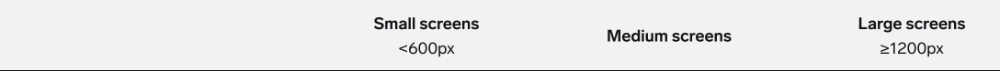
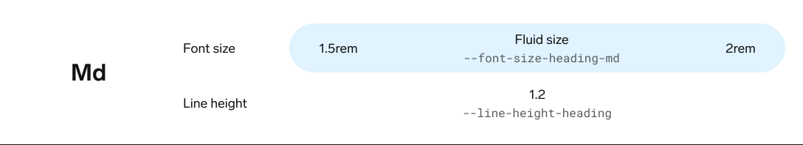
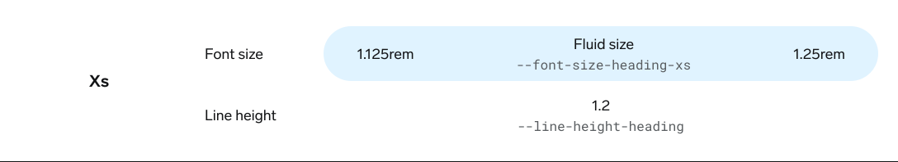
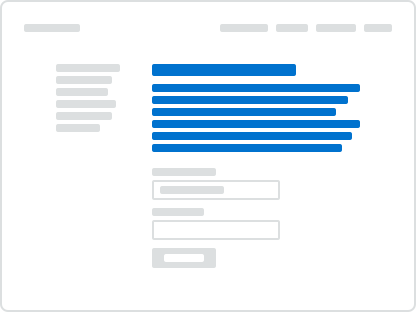
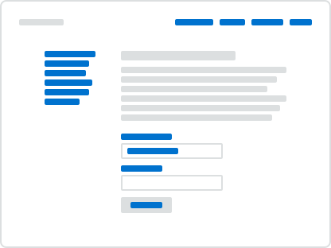
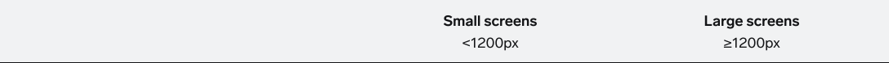
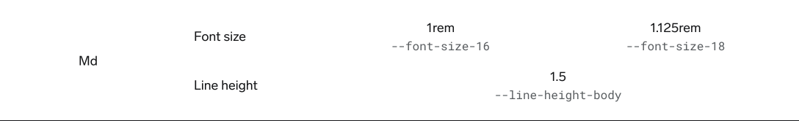
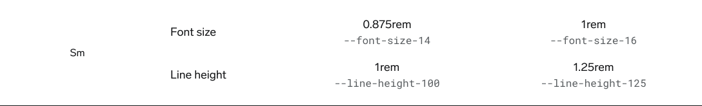

import { CodePreview, TypographyComponent } from '@site/src/components';

# Typography

Tallinn Design System typography is based on the <b>Lab Grotesque </b> typeface. The font licenses can be purchased from the <a className="tds-link tds-link--inline" href="https://lettersfromsweden.se/font/lab-grotesque/" > Letters from Sweden website</a>.

If the use of Lab Grotesque is not possible (for example in documents, emails, presentations etc), it may be substituted with <b>Arial</b>.

## Heading styles

<b>All headings</b> in TDS use fluid type scale. Font size is fixed for mobile
and desktop screens and scales smoothly between them. CSS media queries are not
used for headings.

## Display heading

Display heading is used for large headlines on hero banners.

<b>Do not</b> use for regular page headings.

Font weight: bold (700)

Line height: 1.1

   

<CodePreview
  orientationVertical={true}
  minHeight="150px"
  code={[
    {
      code: TypographyComponent({
        headingSize: 'dp',
        content: 'Dp heading',
      }),
    },
  ]}
/>

## Regular headings

Regular headings are used for page/section headings, subheadings and less prominet headings on hero banners.

Use heading levels semantically. For example after `<h1>`, next heading on the same page should be `<h2>`, not `<h3>`. Heading styles by themselves are level agnostic, that means Medium size heading could be `<h1>` and Large could be `<h2>`, if need be.

- <b>Large</b> — main page headings (h1). Can also be used for section headings
  on home pages for example.
- <b>Medium / Small / xSmall</b> — subheadings in articles and forms, card
  headings etc.

Font weight: bold (700)

Line height: 1.2

      

<CodePreview
  orientationVertical={true}
  minHeight="270px"
  code={[
    {
      code:
        TypographyComponent({
          headingSize: 'lg',
          content: 'Lg heading',
        }) +
        TypographyComponent({
          headingSize: 'md',
          content: 'Md heading',
        }) +
        TypographyComponent({
          headingSize: 'sm',
          content: 'Sm heading',
        }) +
        TypographyComponent({
          headingSize: 'xs',
          content: 'Xs heading',
        }),
    },
  ]}
/>

## Text styles

TDS has two types of text styles, body text and UI text.

<b>Body text</b> styles are primarily used for the main content on a page. UI
text styles are used for any text labels in buttons, forms, navigation
components etc.

Text styles have font sizes defined for small and large screens and responsive sizing is handled by CSS media queries.

  

     Body text
  

  

     UI text
  

## Body text

Default font weight is regular (400), bold (700) can be used to emphasize parts of text. Line height has a same unitless value for all styles.

- <b>Large</b> — lead text in articles. Can also be used for block quotes or for
  highlighting other short content.
- <b>Medium</b> — primary body text.
- <b>Small</b> — less important body text. Can also be used as a primary text
  style in large data tables and other data heavy layouts.

<b>Do not </b> use body text styles for labels in buttons, forms and navigation
components. Use UI text styles instead.

Font weight: regular (400) / bold (700)

Line height: 1.5

     

<CodePreview
  orientationVertical={true}
  minHeight="210px"
  code={[
    {
      code:
        TypographyComponent({
          bodySize: 'lg',
          content: 'Lg body',
        }) +
        TypographyComponent({
          bodySize: 'md',
          content: 'Md body',
        }) +
        TypographyComponent({
          bodySize: 'sm',
          content: 'Sm body',
        }),
    },
  ]}
/>

## UI text

Both regular (400) and bold (700) weights can be used. Line height is defined separately for all styles in rems.

<b>Do not</b> use UI text styles for article body copy. Use body text styles
instead.

--ui-text-md-mobile: 1rem;

     

<CodePreview
  orientationVertical={true}
  minHeight="180px"
  code={[
    {
      code:
        TypographyComponent({
          uiSize: 'md',
          content: 'Md UI',
        }) +
        TypographyComponent({
          uiSize: 'sm',
          content: 'Sm UI',
        }) +
        TypographyComponent({
          uiSize: 'xs',
          content: 'Xs UI',
        }),
    },
  ]}
/>
