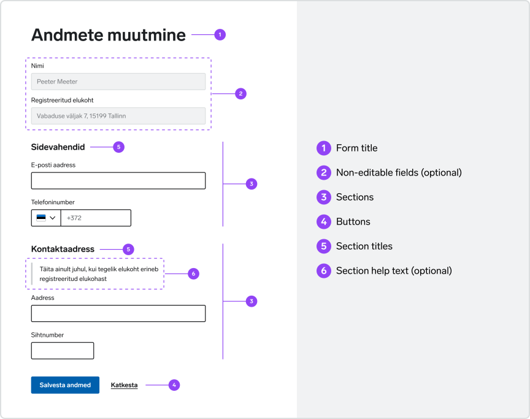
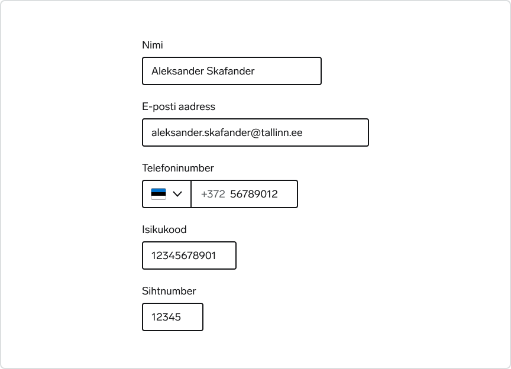

import { CodePreview, CodePreviewGroup } from '@site/src/components';

# Building a form

## Basic anatomy of a form

  

 
 

  
    
      1
    
    <h2>Form title</h2>
  
  

    Every form should have a title. This could be the main page title if the
    form is the primary content on that page or a sub title if the form is
    nested between other content. Titles should describe the intent of the form
    and be as short and clear as possible.
  

  
    
      2
    
    
      <h2>Non-editable fields</h2>{' '}
      (optional)
    
  
  

    In case there is some non-editable data relevant to the form (for example, persons name and address imported from the population register), it can be presented in non-editable input fields.
  

  
    
      3
    
    <h2>Sections</h2>
  
  

    Related fields should be grouped into sections to improve scannability and
    create logical order.
  

  
    
      4
    
    <h2>Buttons</h2>
  
  

    Buttons are placed at the end of the form. Primary buttons should be used
    for submission. If there are multiple buttons, such as an option to save for
    later or navigate back, the non-submission buttons should be secondary or
    tertiary. In a horizontal layout (tablet and desktop screens), the primary
    button should be on the left. In a stacked layout (mobile screens), the
    primary button should be on top.
  

  
    
      5
    
    <h2>Section titles</h2>
  
  

    Every section should have a clear and concise title describing the content
    of the section.
  

  
    
      6
    
    <h2>Section help text</h2>{' '}
    (optional)
  
  

    Sections can have additional guidance information to help users understand
    what is needed from them.
  

## One column layout

A single-column form is quicker to process than a multi-column form because multiple columns disrupt the vertical flow of progressing through the form. A single-column layout helps users maintain momentum, leading to faster completion.

Multi-column forms may lead to fields omission and misinterpretation of the process of form filling.

<CodePreviewGroup>

<CodePreview
  hideCode
  guideline="permitted"
  minHeight="380px"
  svgPath="/img/formUsage/forms-layout-1-do.svg"
  customSvgWidth="60%"
/>

<CodePreview
  hideCode
  guideline="prohibited"
  minHeight="380px"
  svgPath="/img/formUsage/forms-layout-1-dont.svg"
  customSvgWidth="80%"
/>

</CodePreviewGroup>

Exceptions can be made for logically related fields, for example first and last name, address and post code, etc.

<CodePreview
  hideCode
  guideline="permitted"
  minHeight="310px"
  svgPath="/img/formUsage/forms-layout-2-do.svg"
  customSvgWidth="60%"
/>

## Order of form controls

Form fields should be ordered in a predictable and intuitive manner.

To achieve an intuitive flow, order fields by their level of importance and keep related fields near each other.

## Size of form controls

Form controls should be sized to fit their value. Start with the browser default width, and adjust as needed.

Single-line text inputs get a default width set by the browser, but their width can be changed to fit the approximate length of their text. For example, names and emails require longer fields than phone numbers and personal identification codes.

Multi-line textarea get a default width and height set by the browser, but its dimensions can be changed to fit longer blocks of text.

Select dropdown widths are set by the browser to be as wide as the text of its longest option. This default behavior should be preserved unless there is a very specific need to change it.

  

