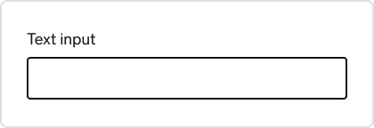
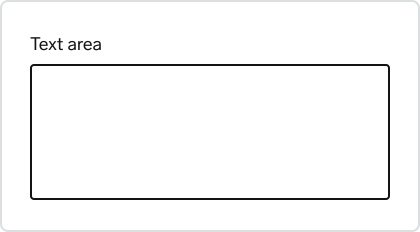
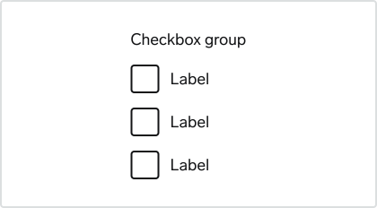
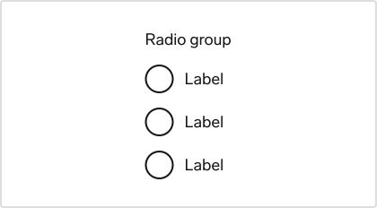
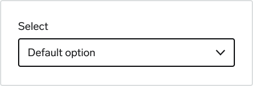

# Choosing the right component

## Text input

Enable the user to input a freeform string of text that does not have a specific format.

  

    <h3>Text input</h3>
    

      Enter short strings of texts or numbers no more than a few words long. For
      example names, emails, addresses etc.
    

  

  

  

    <h3>Text area</h3>
    

      Enter multiple lines of text. For example messages, descriptions, feedback
      etc.
    

  

  

## Data input

These controls enable users to provide input on forms by selecting from a set of pre-determined options or a limited range of values.

  

    <h3>Checkbox</h3>
    

      Select or deselect one or more choices. For example agree to terms and
      conditions, add optional items, select all that apply.
    

  

  

  

    <h3>Radio button</h3>
    

      Select only one option from 2-5 choices.
    

  

  

  

    <h3>Select</h3>
    

      Select only one option from more that five choices.
    

  

  

